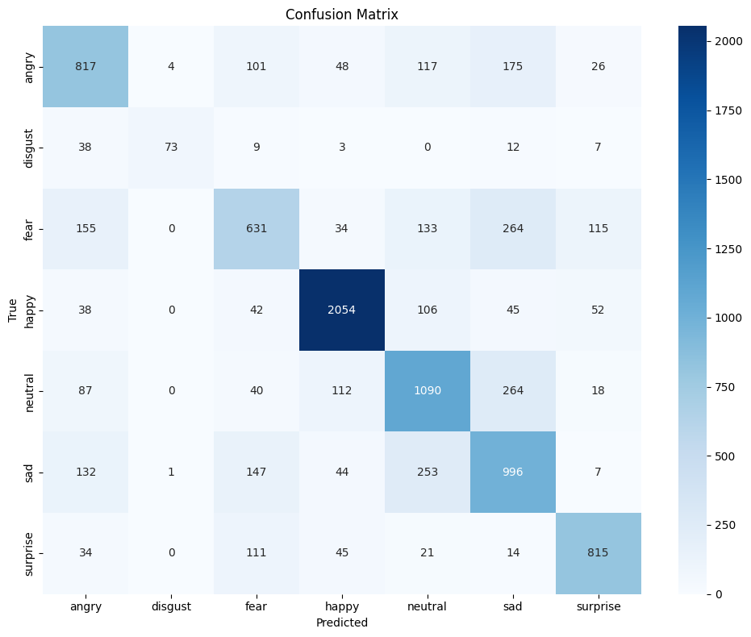

# Facial Expression Recognition with CNN

This project delivers an advanced facial expression recognition system powered by a custom CNN architecture with integrated attention mechanisms. The model efficiently classifies facial expressions into seven emotion categories using a residual network design enhanced with spatial attention. Featuring extensive data augmentation, focal loss to address class imbalance, and differential learning rates, the system achieves robust performance while maintaining deployment feasibility. The architecture balances complexity and efficiency, making it suitable for real-time emotion recognition applications across various platforms including mobile devices.


## Contribution Table

| Name         | Student ID | Contributions                                                                                 |
|--------------|------------|-----------------------------------------------------------------------------------------------|
| Riad Safowan | 2112312642 | • Data augmentation <br>• Model architecture design<br>• Training and validation<br>• Testing |
| Mirza Abir   | 2111252642 | • Research<br>• Dataset preparation <br>• Training and validation<br>• Documentation          |

Both team members collaborated on experimental design, result analysis, and project report preparation.

## Data Augmentation

The dataset (FER-2013) was expanded by 30% using the following augmentation techniques:

1. **Random Rotation**: ±15° rotation to simulate different face angles
2. **Random Shifting**: Up to 10% translation in any direction
3. **Horizontal Flipping**: Mirror images to balance directional features
4. **Random Erasing**: 5-10 pixel patches removed to simulate occlusion

Each augmented image underwent exactly one of these transformations, randomly selected. This approach enhances model
robustness for real-world facial expression recognition on mobile devices.

# Architecture Components

### 1. Base Architecture

The network follows a ResNet-like architecture with custom modifications:

- **Input**: RGB images of size 224×224×3
- **Initial Layer**:
    - 7×7 convolution with 64 filters, stride 2, padding 3
    - Batch normalization
    - ReLU activation
    - 3×3 max pooling with stride 2 and padding 1

### 2. Residual Blocks

The network uses custom residual blocks arranged in 4 sequential layers:

```
Layer 1: 2 ResBlocks (64 → 64 channels)
Layer 2: 2 ResBlocks (64 → 128 channels) with stride 2
Layer 3: 2 ResBlocks (128 → 256 channels) with stride 2
Layer 4: 2 ResBlocks (256 → 512 channels) with stride 2
```

Each **ResBlock** contains:

- 3×3 convolution → Batch normalization → ReLU
- 3×3 convolution → Batch normalization
- Skip connection (identity or 1×1 convolution if dimensions change)
- ReLU activation after addition

### 3. Attention Mechanism

After the residual blocks, an attention mechanism is applied:

- 1×1 convolution to create a single-channel attention map
- Sigmoid activation to normalize attention weights (0-1)
- Element-wise multiplication of features with attention weights

### 4. Classification Head

- Global average pooling to reduce spatial dimensions
- Dropout (p=0.5) for regularization
- Fully connected layer (512 → 7) for final classification

## Network Flow and Feature Maps

The following table illustrates the dimensions of feature maps throughout the network (assuming input resolution of
224×224):

| Layer          | Operation              | Output Size | Parameters |
|----------------|------------------------|-------------|------------|
| Input          | -                      | 224×224×3   | -          |
| Initial        | Conv 7×7, 64, stride 2 | 112×112×64  | 9,408      |
|                | BatchNorm, ReLU        | 112×112×64  | 128        |
|                | MaxPool 3×3, stride 2  | 56×56×64    | -          |
| Layer 1        | ResBlock×2             | 56×56×64    | 73,984     |
| Layer 2        | ResBlock×2             | 28×28×128   | 230,144    |
| Layer 3        | ResBlock×2             | 14×14×256   | 919,040    |
| Layer 4        | ResBlock×2             | 7×7×512     | 3,673,600  |
| Attention      | Conv 1×1, Sigmoid      | 7×7×1       | 513        |
|                | Feature × Attention    | 7×7×512     | -          |
| Classification | Global AvgPool         | 1×1×512     | -          |
|                | Dropout(0.5)           | 1×1×512     | -          |
|                | FC                     | 7           | 3,591      |

## Model Characteristics

- **Total Parameters**: Approximately 4.9 million
- **Input Size**: 224×224×3 RGB images
- **Output**: 7 emotion classes (anger, disgust, fear, happiness, sadness, surprise, neutral)

## Training Details

- **Loss Function**: Focal Loss (to handle class imbalance)
- **Optimizer**: AdamW with differential learning rates
- **Learning Rate Schedule**: ReduceLROnPlateau
- **Data Augmentation**: Random cropping, horizontal flipping, rotation, affine transforms, and color jittering

## Key Innovations

1. **Attention Mechanism**: Enables the model to focus on relevant facial features for emotion recognition
2. **Residual Connections**: Facilitate gradient flow during training of the deep network
3. **Focal Loss**: Handles class imbalance in the FER2013 dataset
4. **Differential Learning Rates**: Allows fine-tuning of different network components at appropriate rates

This custom architecture combines proven deep learning techniques with specific optimizations for the emotion
recognition task, resulting in an effective model for facial expression classification.

# Final Validation Results

## Overall Accuracy

**Final Validation Accuracy**: `0.6941`

---

## Classification Report

| Emotion  | Precision | Recall | F1-Score | Support |
|----------|-----------|--------|----------|---------|
| angry    | 0.63      | 0.63   | 0.63     | 1288    |
| disgust  | 0.94      | 0.51   | 0.66     | 142     |
| fear     | 0.58      | 0.47   | 0.52     | 1332    |
| happy    | 0.88      | 0.88   | 0.88     | 2337    |
| neutral  | 0.63      | 0.68   | 0.65     | 1611    |
| sad      | 0.56      | 0.63   | 0.59     | 1580    |
| surprise | 0.78      | 0.78   | 0.78     | 1040    |

**Accuracy**: `0.69`  
**Macro Avg**: Precision `0.72`, Recall `0.66`, F1-Score `0.68`  
**Weighted Avg**: Precision `0.70`, Recall `0.69`, F1-Score `0.69`

---

### Per-Class Accuracies

- **angry**: `63.43%`
- **disgust**: `51.41%`
- **fear**: `47.37%`
- **happy**: `87.89%`
- **neutral**: `67.66%`
- **sad**: `63.04%`
- **surprise**: `78.37%`

## Confusion Matrix




